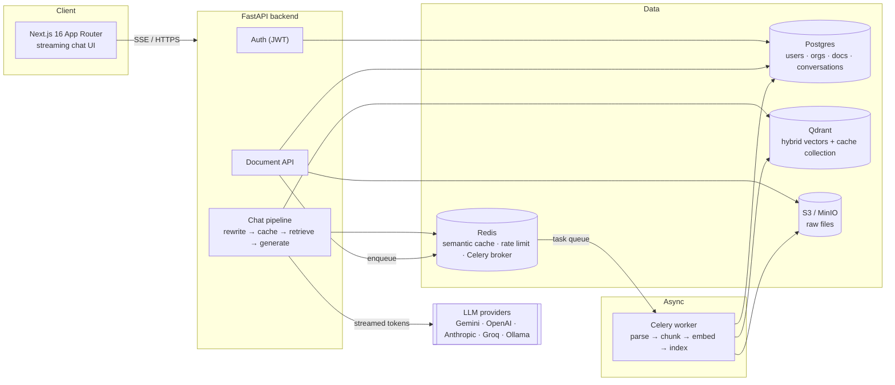

# Lumen


**Upload your documents. Ask questions. Get grounded, cited answers — streamed in real time.**

Lumen is a self-hosted, production-shaped document assistant platform. It combines
hybrid (dense + sparse) vector retrieval, a Redis-backed semantic cache, multi-provider LLM
fallback, and a streaming chat UI, all running as a fully containerized stack you can bring up with
one command.

> Built as a from-scratch, end-to-end systems project: backend, retrieval pipeline, frontend,
> observability, and infra, each verified running before moving to the next.

---

## Screenshots

> _Add your own screenshots here once the stack is running locally —
> `docker compose up -d` and open `http://localhost:3000`._
>
> Suggested shots: the empty-state chat screen, a streamed answer with citation chips expanded,
> the document manager mid-upload, and the Grafana dashboard at `http://localhost:3001`.

| | |
|---|---|
| `docs/screenshot-chat.png` | Streaming chat with citations |
| `docs/screenshot-documents.png` | Document manager |
| `docs/screenshot-grafana.png` | Live Grafana dashboard |

---

## Features

- **Hybrid RAG retrieval** — dense embeddings (`bge-small-en-v1.5`) fused with sparse BM25 via
  Reciprocal Rank Fusion in Qdrant, then reranked with a cross-encoder for precision.
- **Conversational query rewriting** — follow-up questions ("what about the timeline?") are
  reformulated against chat history into a standalone search query before retrieval, so multi-turn
  conversations actually retrieve the right chunks.
- **Streaming chat with citations** — tokens stream over SSE as the model generates; answers cite
  `[1]`, `[2]`… back to the exact source chunks, with hover-to-preview snippets.
- **Semantic caching** — near-duplicate questions are served from a Redis/Qdrant-backed cache
  instead of re-running retrieval + generation.
- **Multi-provider LLM fallback** — one LiteLLM `Router` alias backed by Gemini, OpenAI, Anthropic,
  Groq, or local Ollama; a failed/rate-limited provider automatically fails over to the next.
- **Async document ingestion** — Celery-based pipeline: parse (PDF/DOCX/TXT/MD/CSV) → chunk →
  embed → index, with live status polling in the UI.
- **Real auth** — JWT access + refresh tokens, bcrypt password hashing, per-organization data
  isolation.
- **Observability out of the box** — Prometheus metrics + a provisioned Grafana dashboard
  (request rate, latency percentiles, error rate) with zero manual setup.
- **Type-ahead composer** — suggests example prompts and recent conversation titles as you type.

---

## Architecture



**Request flow for a chat message:**
1. Fold conversation history into a standalone search query (skipped on the first message).
2. Check the semantic cache (Redis lookup → Qdrant similarity match) — on a hit, stream the cached
   answer immediately.
3. On a miss: hybrid search (dense + sparse, RRF-fused) against Qdrant, reranked by a cross-encoder,
   scoped to the user's organization.
4. Stream the LLM's response token-by-token over SSE, with automatic provider fallback on
   error/timeout/rate-limit.
5. Persist the exchange and store it in the semantic cache for next time.

This is deliberately **not** a ReAct/tool-calling agent loop — a single deterministic
retrieve → generate pass is faster, cheaper, and far easier to stream and debug for a document
Q&A use case, and it's what the product actually needs.

---

## Tech stack

| Layer | Choice | Why |
|---|---|---|
| Frontend | Next.js 16 (App Router), React 19, Tailwind v4 | App Router streaming + server components; Tailwind v4's CSS-first config |
| Backend | FastAPI, SQLAlchemy 2.0 (async), Alembic | Async all the way down; typed, fast, great OpenAPI docs for free |
| Auth | `python-jose` (JWT) + `bcrypt` | No `passlib` — it's unmaintained and breaks on bcrypt ≥4 |
| Vector DB | Qdrant | Native hybrid (dense+sparse) search with RRF fusion in one query |
| Embeddings | `fastembed` (ONNX runtime) | No PyTorch — quantized ONNX graphs load in ~1-2s, fast on CPU |
| LLM routing | LiteLLM `Router` | One interface, automatic multi-provider failover, no framework lock-in |
| Task queue | Celery + Redis | Redis is already a hard dependency (cache) — no separate broker service |
| Object storage | S3-compatible (MinIO locally, real S3 in prod) | `boto3`; same code path either way |
| Relational DB | PostgreSQL 15 | Users, orgs, documents, conversations, messages |
| Monitoring | Prometheus + Grafana | Provisioned dashboard, zero manual setup |
| Containerization | Docker, multi-stage builds | Build tools never ship in the runtime image |
| CI | GitHub Actions | Lint + test + build on every push |

---

## Quickstart

**Prerequisites:** Docker & Docker Compose.

```bash
git clone https://github.com/colin-110/lumen.git
cd lumen
cp .env.example backend/.env       # then fill in at least one LLM provider key
docker compose up -d
docker compose exec backend alembic upgrade head
docker compose exec backend python scripts/seed.py
```

Open `http://localhost:3000` — log in with the seeded admin (`admin@enterprise.ai` /
`admin12345`, or whatever `FIRST_SUPERUSER_EMAIL`/`FIRST_SUPERUSER_PASSWORD` you set), upload a
document, and ask it a question.

| Service | URL |
|---|---|
| App | http://localhost:3000 |
| API docs (Swagger) | http://localhost:8000/api/v1/docs |
| Grafana | http://localhost:3001 (`admin`/`admin` by default) |
| Prometheus | http://localhost:9090 |
| Qdrant dashboard | http://localhost:6333/dashboard |
| MinIO console | http://localhost:9006 |

A `Makefile` wraps the common commands: `make up`, `make migrate`, `make seed`, `make test`,
`make lint`.

### Configuration

All configuration is environment-driven — see `.env.example` for the full annotated list. At
minimum, set one LLM provider key in `backend/.env`:

```bash
GEMINI_API_KEY=...        # or OPENAI_API_KEY / ANTHROPIC_API_KEY / GROQ_API_KEY / OLLAMA_API_BASE
PRIMARY_MODEL=gemini/gemini-flash-latest
```

`PRIMARY_MODEL` uses a `-latest` alias rather than a pinned model version deliberately — providers
periodically retire free-tier quota for older pinned model IDs while keeping the rolling alias
funded.

---

## Monitoring

Prometheus scrapes the backend's `/metrics` endpoint every 15s; Grafana comes pre-provisioned with
a dashboard covering:

- Request rate by status code
- p50 / p95 / p99 latency
- 5xx error rate
- Requests by path
- Process memory

No manual dashboard setup — it's there the moment `docker compose up -d` finishes.

---

## Performance & efficiency

Numbers measured on this repo, not marketing copy — `docker stats` before/after an optimization
pass focused specifically on memory:

| | Before | After | Change |
|---|---|---|---|
| Backend container RAM | 1.17 GB | 529 MB | **-55%** |
| Worker container RAM | 537 MB | 481 MB | -10% |
| Backend/worker image size | 1.99 GB | 1.54 GB | -23% |
| Message broker | RabbitMQ (separate service) | Redis (reused) | **-1 whole service** |

What actually moved the needle:
- **`uvicorn --workers 2` → `1`.** Each in-process worker loads its own copy of the dense, sparse,
  and cross-encoder ONNX models — two workers meant two full copies for no throughput gain the
  async event loop wasn't already providing. Scale via container replicas instead
  (`UVICORN_WORKERS` is still overridable per-deployment).
- **Celery broker: RabbitMQ → Redis.** Redis was already a hard dependency for the semantic cache;
  reusing it as the Celery broker removes an entire service instead of adding one.
- **Multi-stage Docker build.** `build-essential`/`libpq-dev` (needed only to compile a couple of
  C-extension dependencies) now live in a discarded builder stage instead of the shipped image.
- **Per-service memory limits** in `docker-compose.yml` so usage stays predictable under load
  instead of unbounded.

Test suite: **22 tests**, backend (`pytest`), covering JWT/password-hashing correctness, text
chunking behavior, and regression coverage for config-parsing bugs (an empty/comma-separated
env var previously crashed the app at startup — now covered so it can't silently regress).

---

## Testing & CI

```bash
make test     # pytest — auth, chunking, config-parsing regression tests
make lint     # ruff (backend) + eslint (frontend)
```

GitHub Actions (`.github/workflows/ci.yml`) runs lint + test on the backend and lint + type-check +
build on the frontend on every push and pull request against `main`.

<details>
<summary>Real <code>pytest</code> output (run against this repo)</summary>

```
============================= test session starts ==============================
platform linux -- Python 3.12.13, pytest-9.1.1, pluggy-1.6.0 -- /usr/local/bin/python3.12
collecting ... collected 22 items

tests/test_chunking.py::test_empty_text_returns_no_chunks PASSED         [  4%]
tests/test_chunking.py::test_short_text_returns_single_chunk PASSED      [  9%]
tests/test_chunking.py::test_long_text_splits_into_multiple_chunks_within_size PASSED [ 13%]
tests/test_chunking.py::test_consecutive_chunks_share_overlap_text PASSED [ 18%]
tests/test_chunking.py::test_no_content_lost_across_chunks PASSED        [ 22%]
tests/test_config.py::test_empty_fallback_models_env_var_does_not_crash PASSED [ 27%]
tests/test_config.py::test_comma_separated_fallback_models PASSED        [ 31%]
tests/test_config.py::test_json_array_fallback_models PASSED             [ 36%]
tests/test_config.py::test_empty_cors_origins_env_var_does_not_crash PASSED [ 40%]
tests/test_config.py::test_comma_separated_cors_origins PASSED           [ 45%]
tests/test_config.py::test_default_settings_construct_without_any_env_vars PASSED [ 50%]
tests/test_main.py::test_health_check PASSED                             [ 54%]
tests/test_main.py::test_openapi_schema_loads PASSED                     [ 59%]
tests/test_main.py::test_chat_requires_auth PASSED                       [ 63%]
tests/test_main.py::test_upload_requires_auth PASSED                     [ 68%]
tests/test_security.py::test_password_hash_roundtrip PASSED              [ 72%]
tests/test_security.py::test_password_hash_is_salted PASSED              [ 77%]
tests/test_security.py::test_verify_password_rejects_garbage_hash_without_raising PASSED [ 81%]
tests/test_security.py::test_bcrypt_72_byte_truncation_is_handled_safely PASSED [ 86%]
tests/test_security.py::test_access_and_refresh_tokens_roundtrip PASSED  [ 90%]
tests/test_security.py::test_decode_token_rejects_tampered_signature PASSED [ 95%]
tests/test_security.py::test_decode_token_rejects_garbage PASSED         [100%]

============================= 22 passed in 18.28s ==============================
```

</details>

## Verify it yourself

Don't take the README's word for it — after `docker compose up -d` (see Quickstart above), check
each layer directly:

```bash
# 1. Containers are up and healthy
docker compose ps

# 2. Backend is alive
curl http://localhost:8000/health
# -> {"status":"ok","version":"1.0.0","environment":"local"}

# 3. Full test suite, inside the actual container
docker compose exec backend sh -c "pip install --quiet pytest pytest-asyncio && pytest -v"

# 4. Prometheus is scraping the backend
curl -s http://localhost:9090/api/v1/targets | grep -o '"health":"[a-z]*"'
# -> "health":"up"
```

Then in a browser: `http://localhost:3000` → log in with the seeded admin → upload a document →
watch its status go `Queued` → `Ready` → ask a question about it and confirm the answer cites the
document you uploaded. `http://localhost:3001` (Grafana) should show live request metrics as you
click around.

---

## Deploying

The stack is fully containerized, so it runs anywhere Docker does. Two realistic paths:

**Cheap/simple — single VM + `docker compose`.** Any VM with ~2GB+ RAM (a `t3.small` on AWS, a
Droplet, a Lightsail instance) works: copy the repo over, set production values in `backend/.env`
(a real `SECRET_KEY`, your LLM key, unique DB/storage passwords), point the frontend's
`NEXT_PUBLIC_API_URL` build arg at the box's public address, and `docker compose up -d`.

A note on AWS's actual free tier: `t2/t3.micro` (1GB RAM) is free for an account's first 12
months, but this stack's core services alone measure ~1.2GB even after the optimization pass above
— genuinely too tight to run reliably without a swap file, and Grafana/Prometheus don't fit
alongside it. A `t3.small` (2GB, ~$15/mo, stoppable when not in use) is the realistic minimum for
the full stack to run without swapping.

**Production — managed services.** Swap the self-hosted infra containers for managed equivalents
without touching application code (`storage.py` already speaks the plain S3 API via `boto3`):

| Container today | Managed equivalent |
|---|---|
| Postgres | RDS / Aurora PostgreSQL |
| Redis | ElastiCache |
| Qdrant | Qdrant Cloud |
| MinIO | Real S3 (drop `S3_ENDPOINT_URL`, use an IAM role) |
| backend/worker/frontend | ECS Fargate or EKS behind an ALB |

---

## Project structure

```
backend/
  app/
    api/v1/endpoints/   # auth, documents, conversations, chat
    core/               # config, security, logging, celery, rate limiting
    crud/                # DB access layer
    models/ schemas/     # SQLAlchemy models + Pydantic schemas
    services/            # retrieval, embeddings, agent pipeline, LLM router, storage
    tasks/                # Celery document ingestion
  alembic/               # migrations
  tests/                  # pytest suite
frontend/
  src/
    app/                  # Next.js App Router pages
    components/           # chat, documents, auth, layout
    lib/                   # API client, auth context, types
monitoring/
  prometheus.yml
  grafana/                # provisioned datasource + dashboard
```

---

## Known limitations

- **Chunking is structure-blind** — fixed 1000-char windows, no awareness of headings/tables.
- **No OCR** — scanned/image-only PDFs return no extractable text.
- **No relevance grading step** — retrieved chunks reach the model based on the reranker score
  alone; nothing double-checks relevance with a second LLM pass.
- **No eval harness** — retrieval precision/recall isn't measured against a fixed test set, so
  retrieval quality changes are currently judged by hand, not by a number.
- **Single-region, single-instance** by default — horizontal scaling works (stateless
  backend/frontend, replica-friendly worker) but isn't wired up as infra-as-code yet.

## Roadmap

- LLM-based relevance grading before generation
- Structure-aware chunking (headings/paragraphs, not raw character counts)
- HyDE (hypothetical document embeddings) for retrieval
- Fixed eval set + measured retrieval precision/recall
- GPU execution provider for embedding/reranking at higher throughput
- Terraform/CDK for the managed-services deployment path

---

## Contributing

See [CONTRIBUTING.md](CONTRIBUTING.md).

## License

Apache 2.0 — see [LICENSE](LICENSE).
