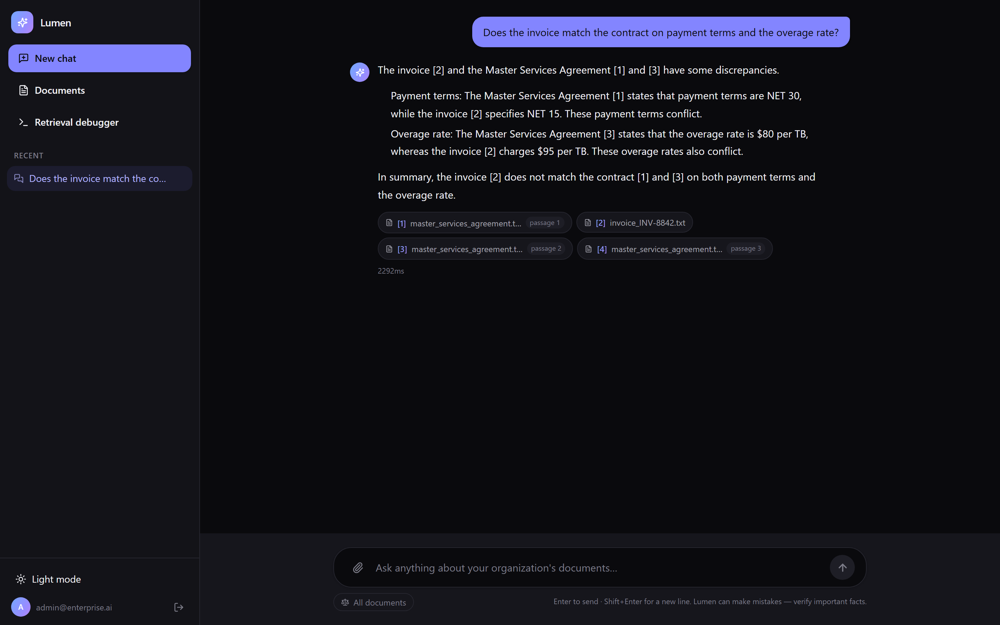
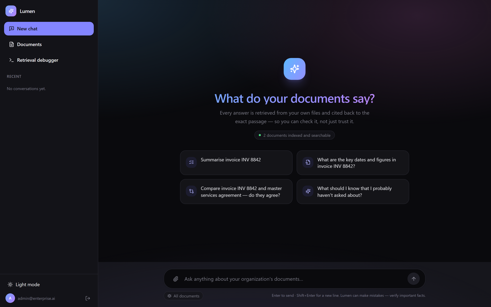
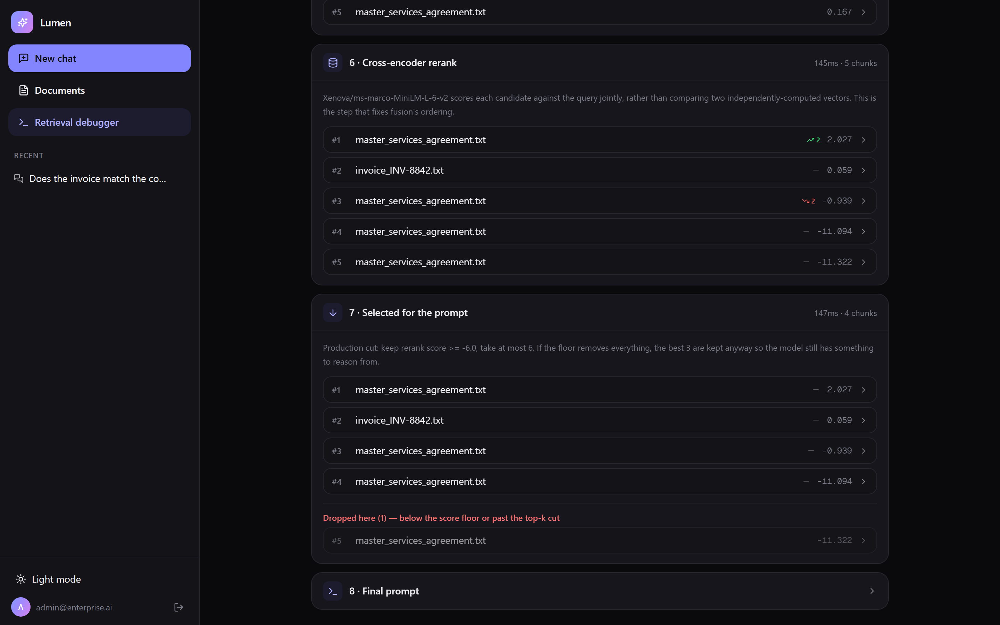
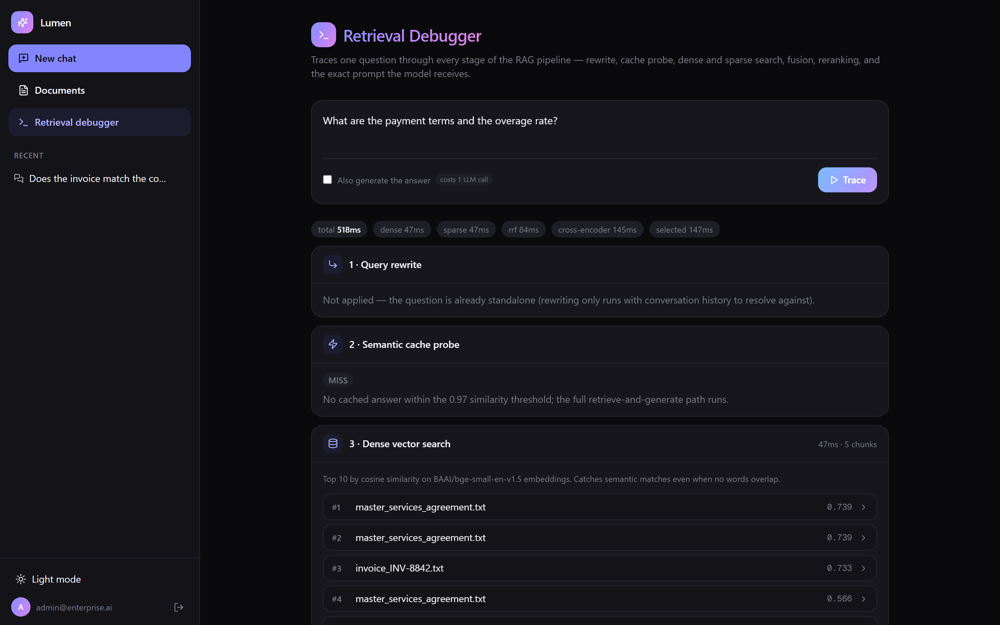
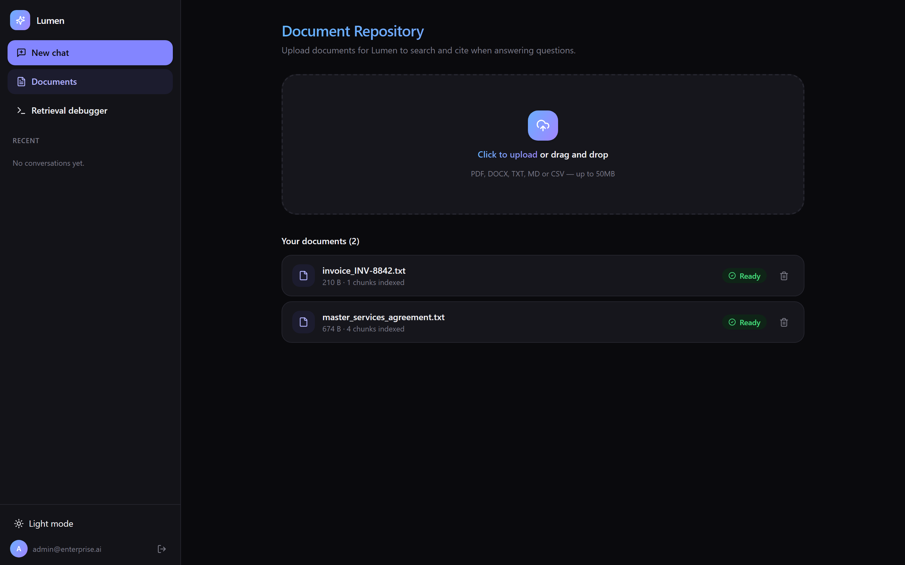
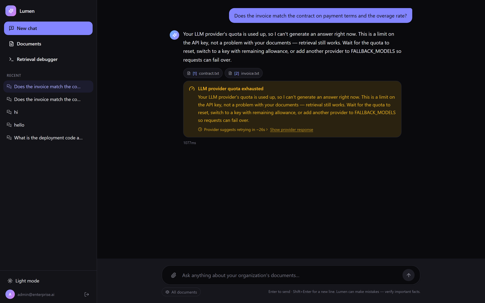
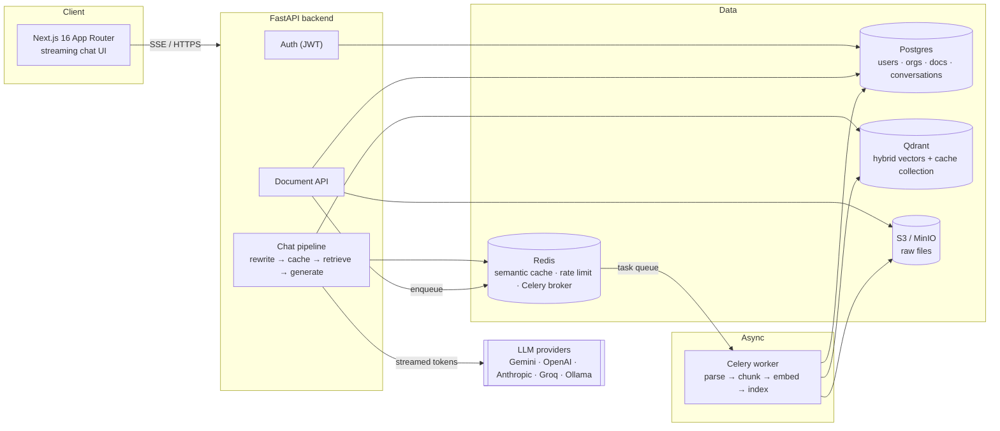

# Lumen


**Upload your documents. Ask questions. Get grounded, cited answers — streamed in real time.**

Lumen is a self-hosted, production-shaped document assistant platform. It combines
hybrid (dense + sparse) vector retrieval, a Redis-backed semantic cache, multi-provider LLM
fallback, and a streaming chat UI, all running as a fully containerized stack you can bring up with
one command.

**Live instance:** [3-218-31-157.nip.io](https://3-218-31-157.nip.io) — sign in as
`admin@enterprise.ai`, upload a document, ask it something. Running on a single AWS
free-tier instance behind Caddy with automatic TLS, deployed by CI on every push to `main`.

> Built as a from-scratch, end-to-end systems project: backend, retrieval pipeline, frontend,
> observability, and infra, each verified running before moving to the next.

---

## Screenshots

**A grounded, multi-document answer.** Two documents that deliberately disagree — a contract saying
NET 30 and $80/TB, an invoice billing NET 15 and $95/TB. The answer names both conflicts and cites
the exact passage behind each claim, including three separate passages from the same contract.
Answering it at all depends on the fair-allocation fix below: under a global top-k the contract's
chunks take every slot and the invoice never reaches the model.



**Empty state.** The suggested questions are built from the documents actually in the corpus —
including a comparison prompt once there are two — rather than a static list that returns nothing
on first use.



**Retrieval debugger** — every pipeline stage for one question, with per-stage latency. This is the
rerank half: the cross-encoder lifts the best chunk two places and pushes another down two, then
the score floor drops a chunk at `-11.322` before the prompt is built.



<details>
<summary>More</summary>

**Pipeline from the top** — query rewrite, semantic-cache probe, dense and sparse search.



**Document manager** — upload, live ingestion status, chunk counts.



**Typed provider errors** — a spent quota is reported as a quota problem, not as a broken API key,
and says plainly that retrieval still worked. Note the citations behind it: retrieval *did* return
both documents.



</details>

> Regenerate against any running instance:
> `cd frontend && node scripts/capture-screenshots.mjs <baseUrl> <email> <password> [apiUrl]`
> It uploads its own fixture documents, fails loudly if they don't finish ingesting, and deletes
> them afterwards.

---

## Features

- **Hybrid RAG retrieval** — dense embeddings (`bge-small-en-v1.5`) fused with sparse BM25 via
  Reciprocal Rank Fusion in Qdrant, then reranked with a cross-encoder for precision.
- **Conversational query rewriting** — follow-up questions ("what about the timeline?") are
  reformulated against chat history into a standalone search query before retrieval, so multi-turn
  conversations actually retrieve the right chunks.
- **Streaming chat with citations** — tokens stream over SSE as the model generates; answers cite
  `[1]`, `[2]`… back to the exact source chunks, with hover-to-preview snippets.
- **Semantic caching** — near-duplicate questions are served from a Redis/Qdrant-backed cache
  instead of re-running retrieval + generation.
- **Multi-provider LLM fallback** — one LiteLLM `Router` alias backed by Gemini, OpenAI, Anthropic,
  Groq, or local Ollama; a failed/rate-limited provider automatically fails over to the next.
- **Async document ingestion** — Celery-based pipeline: parse (PDF/DOCX/TXT/MD/CSV) → chunk →
  embed → index, with live status polling in the UI.
- **OCR fallback** — scanned/image-only PDF pages (no text layer) are rendered and run through
  Tesseract automatically, per-page, so mixed born-digital/scanned PDFs only pay the OCR cost on
  the pages that actually need it.
- **Real auth** — JWT access + refresh tokens, bcrypt password hashing, per-organization data
  isolation.
- **Observability out of the box** — Prometheus metrics + a provisioned Grafana dashboard
  (request rate, latency percentiles, error rate) with zero manual setup.
- **Type-ahead composer** — suggests example prompts and recent conversation titles as you type.
- **Retrieval debugger** — a superuser-only view that traces one question through every pipeline
  stage (rewrite → cache probe → dense/sparse → fusion → rerank → selection → final prompt), showing
  per-stage latency, each candidate's score, how far reranking moved it, and what the score floor
  dropped.
- **Measured retrieval quality** — a golden-dataset harness scores Recall@k / MRR / NDCG across four
  retrieval strategies, so pipeline changes are judged by a number rather than by feel.
- **Multi-document reasoning** — pin a question to several documents and the context budget is split
  round-robin between them, so a long document can't crowd a short one out of a comparison; the
  model is then instructed to attribute each fact and call out conflicts explicitly.

---

## Architecture



**Request flow for a chat message:**
1. Fold conversation history into a standalone search query (skipped on the first message).
2. Check the semantic cache (Redis lookup → Qdrant similarity match) — on a hit, stream the cached
   answer immediately. Skipped entirely when the question is pinned to a document scope, since
   cache entries carry no notion of scope.
3. On a miss: hybrid search (dense + sparse, RRF-fused) against Qdrant, reranked by a cross-encoder,
   scoped to the user's organization — and, when documents are pinned, allocated fairly across them
   so one long document can't fill the whole context.
4. Stream the LLM's response token-by-token over SSE, with automatic provider fallback on
   error/timeout/rate-limit.
5. Persist the exchange and store it in the semantic cache for next time (again, scoped questions
   excluded).

This is deliberately **not** a ReAct/tool-calling agent loop — a single deterministic
retrieve → generate pass is faster, cheaper, and far easier to stream and debug for a document
Q&A use case, and it's what the product actually needs.

---

## Tech stack

| Layer | Choice | Why |
|---|---|---|
| Frontend | Next.js 16 (App Router), React 19, Tailwind v4 | App Router streaming + server components; Tailwind v4's CSS-first config |
| Backend | FastAPI, SQLAlchemy 2.0 (async), Alembic | Async all the way down; typed, fast, great OpenAPI docs for free |
| Auth | `python-jose` (JWT) + `bcrypt` | No `passlib` — it's unmaintained and breaks on bcrypt ≥4 |
| Vector DB | Qdrant | Native hybrid (dense+sparse) search with RRF fusion in one query |
| Embeddings | `fastembed` (ONNX runtime) | No PyTorch — quantized ONNX graphs load in ~1-2s, fast on CPU |
| LLM routing | LiteLLM `Router` | One interface, automatic multi-provider failover, no framework lock-in |
| Task queue | Celery + Redis | Redis is already a hard dependency (cache) — no separate broker service |
| Object storage | S3-compatible (MinIO locally, real S3 in prod) | `boto3`; same code path either way |
| Relational DB | PostgreSQL 15 | Users, orgs, documents, conversations, messages |
| Monitoring | Prometheus + Grafana | Provisioned dashboard, zero manual setup |
| Containerization | Docker, multi-stage builds | Build tools never ship in the runtime image |
| CI | GitHub Actions | Lint + test + build on every push |

---

## Quickstart

**Prerequisites:** Docker & Docker Compose.

```bash
git clone https://github.com/colin-110/lumen.git
cd lumen
cp .env.example backend/.env       # then fill in at least one LLM provider key
docker compose up -d
docker compose exec backend alembic upgrade head
docker compose exec backend python scripts/seed.py
```

Open `http://localhost:3000` — log in with the seeded admin (`admin@enterprise.ai` /
`admin12345`, or whatever `FIRST_SUPERUSER_EMAIL`/`FIRST_SUPERUSER_PASSWORD` you set), upload a
document, and ask it a question.

| Service | URL |
|---|---|
| App | http://localhost:3000 |
| API docs (Swagger) | http://localhost:8000/api/v1/docs |
| Grafana | http://localhost:3001 (`admin`/`admin` by default) |
| Prometheus | http://localhost:9090 |
| Qdrant dashboard | http://localhost:6333/dashboard |
| MinIO console | http://localhost:9006 |

A `Makefile` wraps the common commands: `make up`, `make down`, `make logs`, `make migrate`,
`make seed`, `make test`, `make lint`, plus `make eval-retrieval` and `make eval-generation`
(see [Evaluation](#evaluation)).

### Configuration

All configuration is environment-driven — see `.env.example` for the full annotated list. At
minimum, set one LLM provider key in `backend/.env`:

```bash
GEMINI_API_KEY=...        # or OPENAI_API_KEY / ANTHROPIC_API_KEY / GROQ_API_KEY / OLLAMA_API_BASE
PRIMARY_MODEL=gemini/gemini-flash-latest
```

`PRIMARY_MODEL` uses a `-latest` alias rather than a pinned model version deliberately — providers
periodically retire free-tier quota for older pinned model IDs while keeping the rolling alias
funded.

---

## Monitoring

Prometheus scrapes the backend's `/metrics` endpoint every 15s; Grafana comes pre-provisioned with
a dashboard covering:

- Request rate by status code
- p50 / p95 / p99 latency
- 5xx error rate
- Requests by path
- Process memory

No manual dashboard setup — it's there the moment `docker compose up -d` finishes.

---

## Performance & efficiency

Numbers measured on this repo with `docker stats` / `docker images`, not marketing copy.

**Pass 1 — memory footprint and service count:**

| | Before | After | Change |
|---|---|---|---|
| Backend container RAM | 1.17 GB | 529 MB | **-55%** |
| Message broker | RabbitMQ (separate service) | Redis (reused) | **-1 whole service** |

- **`uvicorn --workers 2` → `1`.** Each in-process worker loads its own copy of the dense, sparse,
  and cross-encoder ONNX models — two workers meant two full copies for no throughput gain the
  async event loop wasn't already providing. Scale via container replicas instead
  (`UVICORN_WORKERS` is still overridable per-deployment).
- **Celery broker: RabbitMQ → Redis.** Redis was already a hard dependency for the semantic cache;
  reusing it as the Celery broker removes an entire service instead of adding one.
- **Multi-stage Docker build.** `build-essential`/`libpq-dev` (needed only to compile a couple of
  C-extension dependencies) now live in a discarded builder stage instead of the shipped image.

**Pass 2 — image size and unbounded containers:**

| | Before | After |
|---|---|---|
| Backend image | 1.67 GB | **1.58 GB** |
| Worker image | 1.67 GB (separate build) | **shared with backend** |
| Grafana image | 1.58 GB (`grafana`) | **1.47 GB** (`grafana-oss`) |
| db / redis / qdrant / minio | no memory limit | explicitly capped |

- **Stripped `onnx`'s bundled test fixtures** (~70 MB of `onnx/backend/test`, never imported at
  runtime) in the builder stage — deleting them in a later layer would not have shrunk the image,
  since earlier layers keep the bytes regardless.
- **Backend and worker now share one built image**, differing only by `command`, instead of
  building two near-identical 1.67 GB images from the same Dockerfile.
- **`grafana/grafana` → `grafana/grafana-oss`**, dropping bundled enterprise plugins this project
  never loads.
- **Memory limits on every service.** `db`, `redis`, `qdrant` and `minio` previously had none and
  could consume all host RAM. The worker's cap was also raised after it was measured at ~697 MB
  against a 700 MB limit — close enough to the ceiling that a large PDF would OOM-kill it mid-task.

**Pass 3 — dependency pruning and startup time:**

| | Before | After |
|---|---|---|
| Backend image | 1.58 GB | **1.41 GB** |
| `import app.main` | 11.4 s | **3.1 s** |
| Container start → `/health` 200 | — | **6.6 s** |

- **Pruned four transitive packages inference never loads** — `sympy` (66 MB), `ml_dtypes` (24 MB),
  `onnx` (14 MB) and `mpmath` (4 MB), plus bundled test suites and `.pyi` type stubs. `onnxruntime`
  loads a `.onnx` file through its own C++ loader; the `onnx` Python package and the symbolic-maths
  stack behind its shape-inference tooling are model-*authoring* dependencies. Verified by wiping
  the model cache and re-running the full download + all three models end to end.
- **`litellm` is no longer imported at module scope.** It measured 8.9 s and ~340 MB resident —
  about 70 % of total import time — and pulls in `litellm.proxy._types` for a proxy server this
  project doesn't run. Every process paid it before serving anything, including `/health`, auth and
  the document endpoints, none of which reach an LLM. It now loads on first use, warmed on a
  background thread at startup so the first chat still finds it ready.

Three things that *looked* prunable in an import trace and are deliberately kept, because the trace
was misleading: `hf_xet` (fastembed's HuggingFace download path hard-fails without it — invisible at
runtime only because models are already cached), `uvloop` (uvicorn selects it through its own loop
setup, not an import from our code) and `psycopg_binary` (backs the sync `postgresql+psycopg` URL
alembic uses for migrations).

Also measured and **rejected**: deleting the 143 MB of `.pyc` files in site-packages. With
`PYTHONDONTWRITEBYTECODE=1` they are never regenerated, so every process start re-compiles from
source — measured at **+4.7 s on every start** (11.4 s → 16.2 s at the time). Not worth 143 MB for a
service that scales by adding replicas.

Usage after ingesting a handful of documents and running several chats — i.e. with the ONNX models
loaded, not at idle:

| Container | RAM / limit |
|---|---|
| worker | 697 MB / 900 MB |
| backend | 503 MB / 900 MB |
| grafana | 187 MB / 256 MB |
| minio | 94 MB / 256 MB |
| qdrant | 85 MB / 512 MB |
| prometheus | 57 MB / 200 MB |
| db | 52 MB / 512 MB |
| frontend | 34 MB / 200 MB |
| redis | 13 MB / 256 MB |

Test suite: **111 tests** — 85 backend (`pytest`) and 26 frontend (`vitest`), covering JWT/password-hashing correctness, text chunking,
retrieval-metric maths, LLM-judge output parsing, fair multi-document context allocation, and
regression coverage for two real bugs — a config-parsing crash on an empty/comma-separated env var,
and a global top-k selection that dropped a pinned document out of a comparison entirely.

---

## Evaluation

Two harnesses, both driven by one hand-authored golden dataset
(`backend/app/evaluation/golden_dataset.py`): 15 fixture documents and 17 questions with known
correct source documents and known correct answers.

### Retrieval

`make eval-retrieval` runs a golden-dataset harness (`backend/app/evaluation/`) that measures
retrieval quality directly — no LLM calls, no API cost, safe to re-run after any change to
chunking, embeddings, or the fusion/rerank pipeline. It ingests 15 fixture documents into an
isolated namespace, runs 17 known-answer questions through four retrieval strategies using the
exact same code paths as production (`app/services/retrieval.py`), and scores each against
Recall@k, MRR, and NDCG@k:

| Strategy | Recall@5 | Recall@10 | MRR | NDCG@10 | Avg latency |
|---|---:|---:|---:|---:|---:|
| Dense only | 98% | 100% | 1.00 | 0.99 | 43ms |
| BM25 (sparse) only | 94% | 94% | 0.91 | 0.92 | 18ms |
| Hybrid (RRF) | 98% | 100% | 1.00 | 0.99 | 42ms |
| Hybrid + reranker | 100% | 100% | 1.00 | 1.00 | 266ms |

This fixture corpus is deliberately small and topically distinct (so ground truth stays
unambiguous to hand-verify), which is why every strategy scores well — the gap between strategies
widens on noisier, larger, more ambiguous real-world corpora. Extend it by adding entries to
`DOCUMENTS`/`QUESTIONS` in `app/evaluation/golden_dataset.py`; nothing else needs to change.

### Generation

`make eval-generation` scores the *answers*, not just the retrieved chunks. Each question runs
through the real pipeline (same retrieval, same system prompt, same LiteLLM router as production
chat), then an LLM judge grades the result on:

- **Faithfulness** — what fraction of the answer's factual claims are actually supported by the
  retrieved context (an unsupported claim is a hallucination, even if it happens to be true)
- **Answer relevancy** — does it address what was asked
- **Answer correctness** — does it match the golden expected answer
- **Hallucination rate** — share of answers containing at least one unsupported claim, plus the
  specific offending claims, printed per-question

The judge is a structured-output prompt through the existing LiteLLM router rather than Ragas or
DeepEval — those pull in `langchain-core`/`datasets`/`pandas`, which contradicts this project's
deliberate no-LangChain dependency stance (see `pyproject.toml`) for no capability this needs.

⚠️ Unlike the retrieval harness, this one costs real tokens: **2 LLM calls per question**. Gemini's
free tier caps this model at **20 requests/day and 5/minute**, so the harness evaluates only the
first 8 questions by default (~16 calls). Pass a count to widen the sample on a paid key:
`python -m app.evaluation.run_generation 17`. Results are omitted here rather than reported from a
partial, quota-throttled run — run it against your own key to generate them.

---

## Multi-document reasoning

Questions like *"does this invoice match the contract?"* fail in a subtle way on a
plain top-k RAG pipeline: retrieval ranks chunks globally, so a long document can consume the
entire context budget and the short one never reaches the model. The answer then looks confident
and is silently one-sided.

Measured on this repo — a 7-chunk contract and a 1-chunk invoice, asked about service levels,
liability and termination:

| Selection | Chunks sent to the model |
|---|---|
| Global top-k (before) | 6 contract chunks, **0 invoice** — comparison impossible |
| Fair allocation (after) | 5 contract + **1 invoice**, same budget |

Selecting a document scope in the composer pins the question to those documents and fills the
context budget **round-robin**: every pinned document contributes its best chunk before any
contributes a second (`allocate_fairly` in `services/retrieval.py`). Within a scope the rerank
score floor is deliberately not applied — excluding a document the user explicitly asked about
would make the comparison unanswerable, and in the trace above the invoice's only chunk scored
−11.4, far below the −6.0 floor. When the context spans more than one document the system prompt
also gains cross-document instructions: attribute each fact to its source, and state explicitly
where documents agree or conflict.

Asking the real question against the pinned pair:

> **No, invoice INV-8842 does not match the contract.** There are conflicts in both the payment
> terms and the egress overage rate:
> - **Payment Terms** — Invoice: NET 15 [1]. Contract: NET 30 [3]. *Conflict.*
> - **Egress Overage** — Invoice: $95.00 per TB [1]. Contract: $80 per TB [4]. *Conflict.*

Two design notes:

- **Default chat is unchanged.** With no scope selected, retrieval behaves exactly as before
  (global top-k above the score floor). Fair allocation only applies to an explicit scope, so
  single-document questions can't regress.
- **Scoped questions bypass the semantic cache entirely**, in both directions. Cache entries are
  keyed on question + tenant with no notion of document scope, so serving one would answer
  "compare A and B" from a different document set — the same failure class as serving a stale
  answer after an upload.

---

## Running on a 1GB host (AWS free tier)

The default stack is production-shaped and measures **1,730 MiB** across nine containers — about
double what a free-tier `t2/t3.micro` gives you. A small-footprint profile is included:

```bash
docker compose -f docker-compose.yml -f docker-compose.free-tier.yml up -d
```

| | Default | Free-tier profile |
|---|---:|---:|
| backend | 741 MiB | 578 MiB |
| worker | 502 MiB | **removed** |
| qdrant | 88 | 136 |
| minio | 93 | 75 |
| grafana + prometheus | 221 | **removed** |
| db + redis + frontend | 85 | 61 |
| **total** | **1,730 MiB** | **850 MiB** |

The single biggest saving is dropping the Celery worker, which loads its own second copy of the
dense and sparse ONNX models. `INGEST_INLINE=true` runs parse → chunk → embed → index inside the
API process instead, reusing the models already resident there. Verified end to end: uploading a
document with no worker container running ingests and becomes searchable.

**The trade-off is real.** Inline ingestion has no retries and no durability — if the API restarts
mid-parse the document is stuck in `PROCESSING`, where Celery's `acks_late` would have requeued it.
Uploads and chat also share one process, so embedding a large PDF adds latency to concurrent
questions. This profile is for a demo or single user, not upload volume.

850 MiB on a 1024 MiB instance leaves very little for the OS; add a swap file, or offload the
stateful services to managed free tiers (real S3, Qdrant Cloud, Neon) to reach roughly 640 MiB.
`docker-compose.free-tier.yml` documents the exact env vars for each.

---

## Retrieval debugger

Aggregate metrics tell you *whether* retrieval is working; they don't tell you *why* a specific
answer went wrong. `/debug` (superuser-only, linked in the sidebar) traces one question through
every stage of the pipeline:

```
question → query rewrite → semantic-cache probe
        → dense search → sparse/BM25 search → RRF fusion
        → cross-encoder rerank → production score-floor cut
        → the exact prompt sent to the model → (optional) answer
```

Each stage shows its own latency, every candidate chunk with its score, and — from the rerank stage
onward — **how far each chunk moved**, so the reranker's effect is visible rather than asserted. The
final stage separately lists what got **dropped** by the score floor / top-k cut, which is where a
plausible-looking candidate usually disappears.

A real trace, asking *"How much can I spend on food per day when travelling?"* against five
documents:

| Stage | Result |
|---|---|
| Dense | `expenses .761` · `travel .640` · `perdiem .632` · `incident .474` · `vpn .447` |
| BM25 | `expenses 15.08` · `travel 6.60` · `perdiem 5.12` · `vpn 2.89` |
| RRF fusion | `expenses` · `travel` · `perdiem` · `vpn` · `incident` |
| Cross-encoder | `expenses 4.23` · `perdiem −9.74` ↑1 · `travel −10.48` ↓1 · `vpn −11.15` · `incident −11.20` |
| Selected | `expenses` only — the other four fall below the −6.0 floor |

That last row is the useful part: five candidates survive fusion, and the cross-encoder is what
recognises that only one of them actually answers the question.

The retrieval stages are computed locally, so tracing costs nothing. The two paid steps are opt-in:
query rewriting only runs when a `conversation_id` is supplied, and answer generation only when the
"Also generate the answer" toggle is on. The endpoint is gated on `is_superuser` because the
response includes the system prompt and raw chunk text.

---

## Testing & CI

```bash
make test             # pytest (100) + vitest (26)
make lint             # ruff (backend) + eslint (frontend)
make eval-retrieval   # retrieval quality harness — free, no LLM calls
make eval-generation  # answer quality harness — costs LLM tokens, see "Evaluation" above
```

**126 tests across seven layers.** Each targets something that can break silently
rather than padding a count with render smoke tests.

| Layer | Count | What it protects |
|---|---:|---|
| Unit — security | 7 | JWT round-trip, tampered-signature rejection, bcrypt salting and the 72-byte truncation edge |
| Unit — retrieval | 21 | Fair multi-document allocation, score-floor selection, structure-aware chunking |
| Unit — evaluation | 20 | Recall@k / MRR / NDCG maths, LLM-judge output parsing |
| Contract — API | 4 | Auth is actually enforced on chat and upload; OpenAPI schema loads |
| Security — tenant isolation | 10 | The Qdrant filter always carries a tenant condition, and caller-supplied `document_ids` narrows it rather than replacing it |
| Concurrency — worker | 5 | Ingestion tasks share one event loop per process, so the DB pool outlives task 1 |
| Regression | 33 | Every bug in the table below, reproduced then locked down |
| Frontend — Vitest | 26 | SSE frame parsing, citation numbering, typed error rendering |

Notable cases, chosen because they're the ones that would otherwise regress unnoticed:

- **SSE frames split across network reads** — a single frame arriving in two TCP
  chunks breaks naive line-buffered parsers.
- **Context truncation** — a fact is planted past the 600-character preview cut and
  asserted to survive into the prompt.
- **Fair allocation** — reproduces a measured trace where six contract chunks
  out-ranked an invoice's only chunk, and asserts the invoice still reaches the model.
- **Quota vs. auth** — asserts a spent quota is never rendered as "rejected the API key".
- **Tenant isolation** — `document_ids` arrives in the request body and is therefore
  attacker-controlled. A test asserts it is ANDed onto the tenant condition rather than
  substituted for it, and that no retrieval entry point can be called without a tenant
  argument. Cross-tenant leakage would be silent: the answer would still look plausible.
- **One event loop per worker process** — reduces the ingestion outage below to a Future
  created during "task 1" and awaited during "task 2". Under `asyncio.run()` that raises;
  under the fix it doesn't. A single-document smoke test passes either way, which is
  precisely why the bug survived manual testing.

**Pipeline.** Push to `main` → CI (lint, 100 pytest, 26 vitest, Next build) → on success,
CD deploys to EC2 over AWS SSM and runs a health smoke test. Deployment uses SSM rather
than SSH specifically so the instance needs **no inbound port opened** to GitHub's dynamic
runner IPs. The deploy IAM user is scoped to `ssm:SendCommand` on one instance ARN.

---

## Problems found and fixed

Each was found by measuring rather than reading, reproduced, then covered by a test.

| Problem | Cause | Fix |
|---|---|---|
| **Only the first upload per worker process ever indexed** | Celery ran each task under `asyncio.run()`, which closes its loop on exit. The async DB engine is a module-level singleton, so its pooled asyncpg connections stayed bound to that dead loop; task 2 checked one out, died with "got Future attached to a different loop", retried, died again. Documents sat in `QUEUED` forever. | One long-lived event loop per worker process (`run_async`), so every loop-bound resource sees the same loop for the process's lifetime |
| **Model blind to 40% of every chunk** | The prompt was built from `SourceRef.snippet`, a 600-char *UI preview*, while chunks are 1000 chars. Retrieval surfaced the right passage; the answer said "the context doesn't say". | `_format_context` takes chunks and uses full text; snippet stays bounded for the UI |
| **Stale answers after upload** | Semantic cache keyed on question embedding + tenant, with no invalidation when the document set changed. A new document returned the old document's answer. | Invalidate on ingest-complete and delete; scoped questions bypass the cache in both directions |
| **One-sided comparisons** | Global top-k let a 7-chunk contract take all six slots; the pinned invoice never reached the model, so "do these match?" was unanswerable | Round-robin allocation across pinned documents |
| **Only one document searched** | Cross-encoder scores non-answers near −10 against a −6.0 floor, collapsing broad queries to a single chunk | Floor only trims; never below `MIN_CONTEXT_CHUNKS` |
| **Quota reported as a broken key** | Every provider failure rendered "check that an API key is configured" | Typed classification: quota / rate-limit / auth / timeout / unavailable / context-length |
| **Chunks straddling sections** | Flat character splitting mixed the tail of one clause with the head of the next | Split at headings; every chunk carries its heading |
| **Upload appeared to vanish** | Progress chip removed before the awaited list refetch returned | Await invalidation, then clear the chip |
| **Frontend called `localhost` in prod** | `NEXT_PUBLIC_API_URL` is inlined at *build* time and was baked as localhost | Build arg set to the public origin; single-origin via Caddy |

---

## Load test

`python backend/scripts/load_test.py [baseUrl] [email] [password]` — no external
dependencies beyond `httpx`, and the retrieval stage consumes no LLM quota.

Numbers below are from the free-tier profile (single uvicorn worker, 900 MB container
cap, 2 vCPU), with the load generator running **outside** the container under test.

**Framework throughput** — `GET /health`, no DB, no auth:

| Concurrency | Throughput | p50 | p95 | Errors |
|---:|---:|---:|---:|---:|
| 5 | 401 req/s | 8 ms | 20 ms | 0 |
| 10 | 340 req/s | 25 ms | 41 ms | 0 |
| 20 | 260 req/s | 61 ms | 165 ms | 0 |
| 50 | — | — | — | **container OOM-killed** |

**Retrieval** — full hybrid search: dense + sparse query embedding, RRF fusion,
cross-encoder rerank over 40 candidates. All CPU-bound in-process, no LLM call:

| Concurrency | p50 | p95 |
|---:|---:|---:|
| 1 | 1,237 ms | 1,417 ms |
| 5 | 5,054 ms | 22,218 ms |

**Semantic cache** — the same question asked twice:

| | Latency |
|---|---:|
| Cache miss (retrieve + generate) | 15,411 ms |
| Cache hit | **44 ms** |

### What the load test found

**The semantic cache had never worked.** `qdrant-client` removed `.search()` in favour
of `query_points`, so every lookup raised `AttributeError`, was caught by the surrounding
`try/except`, logged a warning, and returned a clean miss. The application behaved
correctly and no test failed — an advertised feature had silently never functioned, and
every repeated question paid a full retrieval and a full LLM generation. Fixing it is the
350× figure above. Reading the code would not have found this; the error handling was
*correct*, it just hid a permanent failure.

**The backend is OOM-killed at concurrency 50** (`OOMKilled=true`, exit 137). The cause is
structural, not a leak: the process holds ~500 MB of ONNX weights, leaving little headroom
inside a 900 MB cap once per-connection buffers are added. Raising the limit would move the
number without addressing it — see the ceilings table below.

**Retrieval does not scale within one process.** Going from 1 to 5 concurrent queries moves
p95 from 1.4 s to 22 s. Reranking 40 candidates through a cross-encoder is CPU-bound, so
concurrent requests contend for the same two cores rather than overlapping. This is the
single strongest argument for the shared embedding service described below.

---

## Scalability

Honest limits of the current design, and what each would take to lift.

**Where it scales today.** The API and frontend are stateless and replica-safe. The
worker is horizontally scalable — Celery with `acks_late`, so a task survives a worker
dying. All state is in Postgres, Qdrant, Redis or S3, none of it on the container.

**The binding constraint is model memory.** Each API process and each worker loads its
own copy of the dense, sparse and cross-encoder ONNX models (~500 MB). That's why
`UVICORN_WORKERS` defaults to 1 and scaling is by replica, not by in-process worker.
Beyond a handful of replicas the right move is to split embedding/reranking into its own
service so the weights are resident once per node rather than once per process — measured
at ~150 MB of weights, so it pays for itself quickly.

| Ceiling | Hit at roughly | Lift it by |
|---|---|---|
| Single-node memory | ~2 replicas on 2 GB | Shared embedding service; managed Qdrant/Postgres |
| Rate limits are per-user | Any open-registration deployment | Global spend cap keyed on org, not user |
| Semantic cache is tenant-wide | Large orgs, diverse questions | Per-user namespacing; TTL tuned from hit-rate metrics |
| Reranker latency ~200 ms | Sustained concurrency | GPU execution provider, or rerank fewer candidates |
| Qdrant single node | Millions of chunks | Qdrant Cloud / sharded collection |
| Inline ingestion (free-tier profile) | Any real upload volume | Use the default profile with a Celery worker |

**Not yet addressed:** no horizontal-scaling infra-as-code and no autoscaling policy. The
ceilings above are now backed by the load test rather than reasoned from per-process
memory alone — see the measured OOM at concurrency 50 and the retrieval contention at
concurrency 5.

GitHub Actions (`.github/workflows/ci.yml`) runs lint + test on the backend and lint + type-check +
build on the frontend on every push and pull request against `main`.

<details>
<summary>Real <code>pytest</code> output (run against this repo)</summary>

```
$ cd backend && poetry run pytest -q

tests/test_agent_context.py ......                                 [  6%]
tests/test_celery_event_loop.py .....                              [ 11%]
tests/test_chunking.py .....                                       [ 16%]
tests/test_chunking_structure.py ..........                        [ 26%]
tests/test_config.py ......                                        [ 32%]
tests/test_evaluation_judge.py ......                              [ 38%]
tests/test_evaluation_metrics.py .......                           [ 45%]
tests/test_llm_errors.py ..............                            [ 59%]
tests/test_main.py ....                                            [ 63%]
tests/test_query_rewrite_gate.py .........                         [ 72%]
tests/test_retrieval_allocation.py ...........                     [ 83%]
tests/test_security.py .......                                     [ 90%]
tests/test_tenant_isolation.py ..........                          [100%]

100 passed in 6.69s
```

</details>

## Verify it yourself

Don't take the README's word for it — after `docker compose up -d` (see Quickstart above), check
each layer directly:

```bash
# 1. Containers are up and healthy
docker compose ps

# 2. Backend is alive
curl http://localhost:8000/health
# -> {"status":"ok","version":"1.0.0","environment":"local"}

# 3. Full test suite (runs on the host — the runtime image deliberately
#    ships no tests/ directory, only what's needed to serve traffic)
cd backend && poetry install && poetry run pytest -q
# -> 100 passed

# 4. Retrieval quality against the golden dataset — no LLM calls, costs nothing
make eval-retrieval

# 5. Prometheus is scraping the backend
curl -s http://localhost:9090/api/v1/targets | grep -o '"health":"[a-z]*"'
# -> "health":"up"
```

Then in a browser: `http://localhost:3000` → log in with the seeded admin → upload a document →
watch its status go `Queued` → `Ready` → ask a question about it and confirm the answer cites the
document you uploaded. `http://localhost:3001` (Grafana) should show live request metrics as you
click around.

To see the retrieval machinery rather than just its output, upload two documents that disagree
about something, then: open `/debug` and trace a question to watch the reranker reorder candidates
and the score floor drop them; and in the chat composer select both documents under the scope
picker and ask whether they match — the answer should cite both and name the conflict.

---

## Deploying

The stack is fully containerized, so it runs anywhere Docker does. Two realistic paths:

**Cheap/simple — single VM + `docker compose`.** Any VM with ~2GB+ RAM (a `t3.small` on AWS, a
Droplet, a Lightsail instance) works: copy the repo over, set production values in `backend/.env`
(a real `SECRET_KEY`, your LLM key, unique DB/storage passwords), point the frontend's
`NEXT_PUBLIC_API_URL` build arg at the box's public address, and `docker compose up -d`.

A note on AWS's actual free tier: `t2/t3.micro` (1GB RAM) is free for an account's first 12
months, but this stack's core services alone measure ~1.2GB even after the optimization pass above
— genuinely too tight to run reliably without a swap file, and Grafana/Prometheus don't fit
alongside it. A `t3.small` (2GB, ~$15/mo, stoppable when not in use) is the realistic minimum for
the full stack to run without swapping.

**Production — managed services.** Swap the self-hosted infra containers for managed equivalents
without touching application code (`storage.py` already speaks the plain S3 API via `boto3`):

| Container today | Managed equivalent |
|---|---|
| Postgres | RDS / Aurora PostgreSQL |
| Redis | ElastiCache |
| Qdrant | Qdrant Cloud |
| MinIO | Real S3 (drop `S3_ENDPOINT_URL`, use an IAM role) |
| backend/worker/frontend | ECS Fargate or EKS behind an ALB |

---

## Project structure

```
backend/
  app/
    api/v1/endpoints/  # auth, documents, conversations, chat, debug
    core/              # config, security, logging, celery, rate limiting
    crud/              # DB access layer
    models/ schemas/   # SQLAlchemy models + Pydantic schemas
    services/          # retrieval, embeddings, agent pipeline, LLM router, storage
    tasks/             # Celery document ingestion
    evaluation/        # golden dataset + retrieval and generation eval harnesses
  alembic/             # migrations
  tests/               # pytest suite
frontend/
  src/
    app/               # Next.js App Router pages (chat, documents, debug, auth)
    components/        # chat, documents, debug, auth, layout
    lib/               # API client, auth context, types, shared hooks
monitoring/
  prometheus.yml
  grafana/             # provisioned datasource + dashboard
```

---

## Known limitations

- **Chunking is structure-blind** — fixed 1000-char windows, no awareness of headings/tables.
- **No relevance grading step** — retrieved chunks reach the model based on the reranker score
  alone; nothing double-checks relevance with a second LLM pass.
- **Eval set is small** — 15 documents / 17 questions, hand-authored and topically distinct. Enough
  to catch a regression, not enough to be a benchmark; a free-tier LLM key also caps the generation
  harness to ~8 questions per day.
- **Single-judge generation eval** — faithfulness/hallucination scores come from one LLM judge with
  no human-agreement calibration, so treat them as a regression signal, not ground truth.
- **Comparison scope is manual** — you pick which documents to compare; nothing detects that a
  question is comparative and selects them for you.
- **Fair allocation is scope-only** — it deliberately doesn't apply to unscoped chat, so an
  unpinned comparative question can still end up one-sided. Making it the global default needs an
  eval set with multi-chunk documents to prove it doesn't regress single-document questions.
- **Single-region, single-instance** by default — horizontal scaling works (stateless
  backend/frontend, replica-friendly worker) but isn't wired up as infra-as-code yet.

## Roadmap

- LLM-based relevance grading before generation
- Structure-aware chunking (headings/paragraphs, not raw character counts)
- HyDE (hypothetical document embeddings) for retrieval
- Larger eval set + human-calibrated judge agreement, and eval wired into CI as a regression gate
- GPU execution provider for embedding/reranking at higher throughput
- Terraform/CDK for the managed-services deployment path

---

## Contributing

See [CONTRIBUTING.md](CONTRIBUTING.md).

## License

Apache 2.0 — see [LICENSE](LICENSE).
